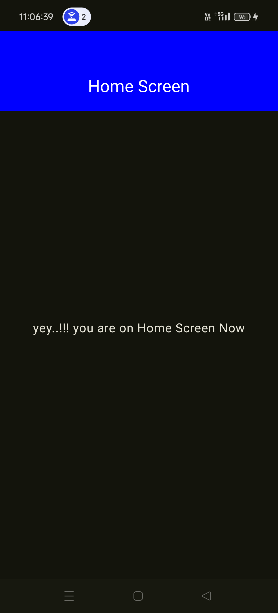

Here’s the updated README with the app name **KeyVault**:

---

# 🔑 **KeyVault**
  
*A secure and seamless PIN management and authentication app.*

---

---

## 📦 Download the APK
Click the link below to download the latest version of the app:

[](/images/resource/app-debug.apk)

---

## 🎥 Demo Video
Watch the app in action by clicking the link below:

[](/images/resource/test_video.mp4)

---

## 🚀 **Overview**

**KeyVault** is a state-of-the-art mobile application designed to enhance security and authentication workflows. Developed using **Jetpack Compose** and based on **Clean Architecture**, it prioritizes robustness, security, and a superior user experience.

### 🔐 Key Features
- **Secure PIN Management**: Create, verify, and reset PINs effortlessly and securely.
- **OAuth 2.0 Integration**: Enable smooth and secure access token handling.
- **Enhanced Security**: Protect sensitive data using **EncryptedSharedPreferences**.

---

## 🛠 **Tech Stack**

### Core Technologies
- **Jetpack Compose**: For a modern, declarative UI.
- **Kotlin**: Language of choice for concise and expressive code.
- **Clean Architecture**: Ensures maintainability and testability.
- **Flows & Coroutines**: For seamless asynchronous data streams and operations.
- **ViewModels**: To manage UI-related data lifecycle-aware.

### Additional Tools
- **Secure Preferences**: For encrypted local storage.
- **OAuth 2.0**: For secure token-based authentication.
- **Retrofit**: Simplifies API interactions.
- **Dagger Hilt**: Dependency injection for modular and testable components.
- **Navigation Graph**: For smooth and dynamic screen navigation.
- **Mockito & Unit Testing**: Ensures quality and reliability through comprehensive testing.

---

## 💡 **Why These Technologies?**

### 1. **Jetpack Compose**
- **Modern UI Development**: A declarative framework that simplifies UI creation, reducing boilerplate and enabling dynamic components effortlessly.
- **Animation Support**: Built-in tools for smooth animations and transitions.
- **Performance Benefits**: Optimized rendering pipeline improves responsiveness and performance compared to traditional XML layouts.

### 2. **Kotlin**
- **Conciseness**: Reduces code verbosity, making it more readable and maintainable.
- **Safety**: Null safety, type inference, and other features minimize runtime crashes.
- **Advanced Features**: Supports **delegation**, **lambdas**, and **higher-order functions** for clean, functional programming.

### 3. **Clean Architecture**
- **Separation of Concerns**: Divides the app into layers (Domain, Data, and UI) for better organization and scalability.
- **Testability**: Clear separation ensures easy testing of individual components.
- **Modularity**: Allows independent updates to layers without affecting others, making it easier to add new features.

### 4. **Dagger Hilt**
- **Simplified Dependency Management**: Reduces boilerplate code for dependency injection.
- **Improved Testability**: Makes mocking and testing components effortless.
- **Lifecycle Awareness**: Automatically manages scoped dependencies based on Android lifecycle.

### 5. **Flows & Coroutines**
- **Asynchronous Programming**: Simplifies managing background tasks with structured concurrency.
- **State Management**: Flows allow seamless updates to UI components by observing real-time data streams.
- **Performance**: Coroutines eliminate callback hell, improving readability and reducing overhead.

### 6. **Retrofit**
- **Efficient Networking**: Simplifies API calls with concise definitions and response handling.
- **Scalability**: Supports converters like GSON and Moshi for seamless JSON parsing.
- **Ease of Use**: Clean annotations for HTTP methods (GET, POST) streamline API implementation.

### 7. **OAuth 2.0**
- **Secure Authentication**: Industry-standard protocol ensures secure token-based communication.
- **Access Token Management**: Protects sensitive APIs and enhances user security with token expiration and refresh.

### 8. **EncryptedSharedPreferences**
- **Data Security**: Encrypts sensitive user data, such as PINs, to prevent unauthorized access.
- **Ease of Implementation**: Android's built-in encryption tools simplify integration.

### 9. **Navigation Graph**
- **Seamless Navigation**: Provides a single source of truth for app navigation.
- **Safe Args**: Simplifies passing data between screens with type safety.

### 10. **Testing with Mockito**
- **Mocking Made Easy**: Ensures that only the component under test is evaluated by mocking dependencies.
- **Improves Confidence**: Verifies functionality with unit tests, reducing bugs and regressions.

### 11. **Security**
- **Encrypted Preferences**: Protects user credentials and sensitive information locally.
- **Secure Practices**: Implements SOLID principles and clean coding patterns to minimize vulnerabilities.

### Why These Technologies Work Together
- **Scalability**: Clean Architecture, Dagger Hilt, and Navigation Graph ensure the app can grow without code clutter.
- **Security**: OAuth 2.0 and encrypted storage make KeyVault a trustworthy solution for sensitive data.
- **Performance**: Kotlin, Coroutines, and Jetpack Compose guarantee a smooth user experience.

---

## 📸 **Screenshots**

|  |  |  |  
|:-------------------------------:|:---------------------------------:|:---------------------------------:|  
|          **Screen 1**           |           **Screen 2**            |           **Screen 3**            |  

|  |  |  |  
|:---------------------------------:|:---------------------------------:|:---------------------------------:|  
|      **Confirmation Dialog**      |      **Cancellation Dialog**      |           **Screen 4**            |  

|  |  |  
|:---------------------------------:|:---------------------------------:| 
|       **Pin Confirmation**        |          **Home Screen**          |
---

## 🧪 **Testing**

We prioritize app reliability and quality through:
- **Unit Testing**: Verifying individual components for expected behavior.
- **Mockito**: Mocking dependencies to isolate tests and validate interactions.

```kotlin  
 @Test
fun `test onNextClicked Create Step ConfirmPin success`() {

   viewModel.updateFirstPin("123456")

   viewModel.onNextClicked(StepMode.Create, null) {
      val capturedValue = it.first
      assertEquals("123456", capturedValue)
      assertTrue(it.second)
   }

}  
```  

---

## 🗂 **Project Structure**

```
KeyVault/
├── core/          # Reusable utilities and helpers  
├── data/          # API calls, repositories, and local storage
├── di/            # Dependency Injection setup  
├── domain/        # Business logic and entities             
├── ui/            # Screens and UI components (Jetpack Compose)    
└── tests/         # Unit and integration tests  
```  

---

## 🌟 **Get Started**

1. Clone the repository:
   ```bash  
   git clone https://github.com/VipulDamor/keyVault  
   ```  
2. Open in **Android Studio**.
3. Run the project on an emulator or physical device.

---

**Start securing your authentication today with KeyVault!**